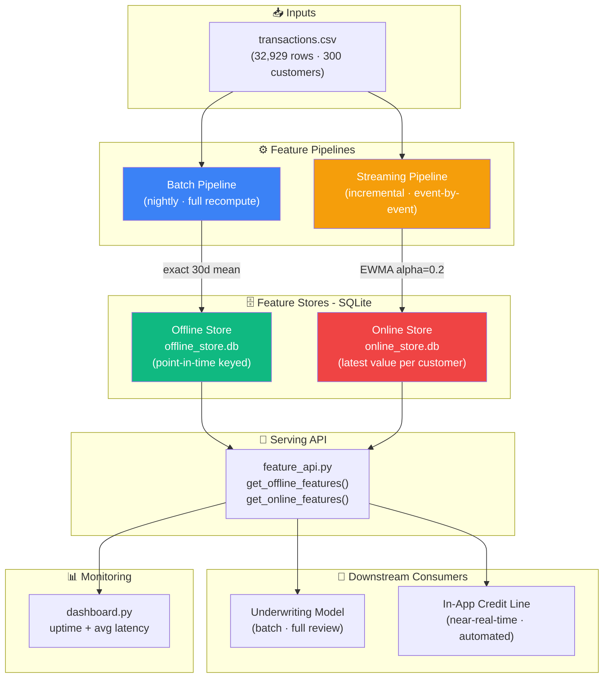
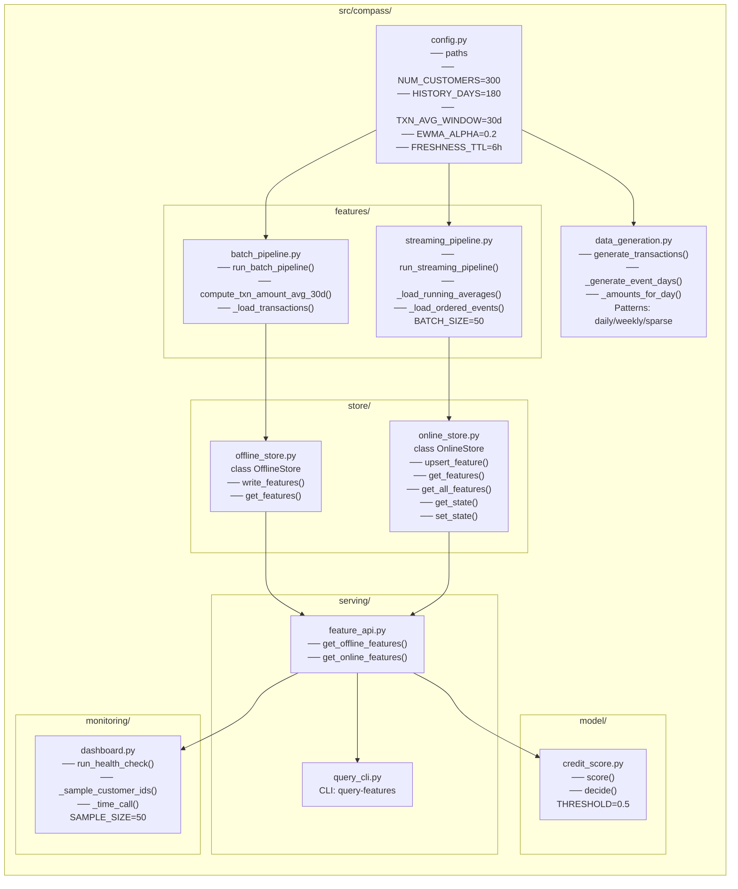
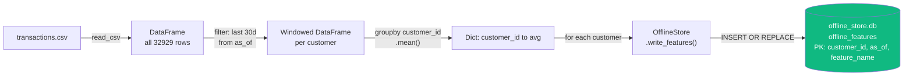
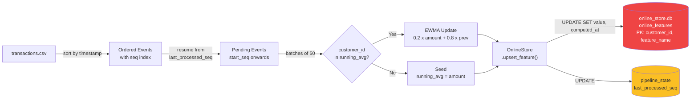
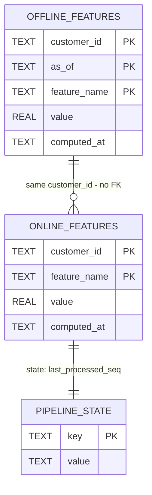
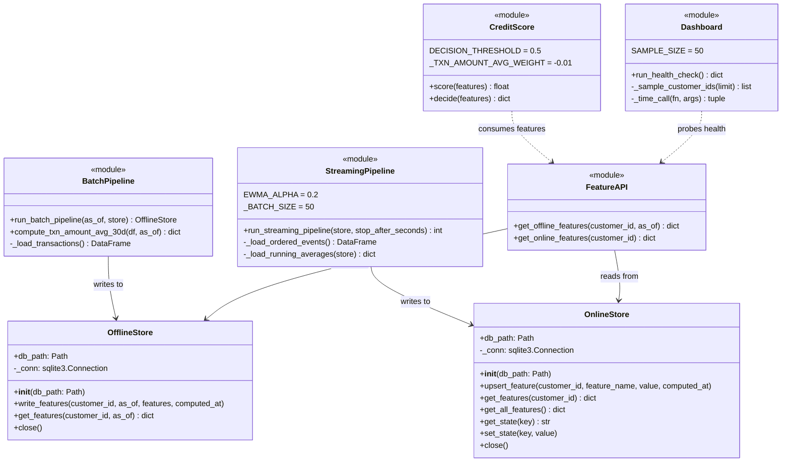
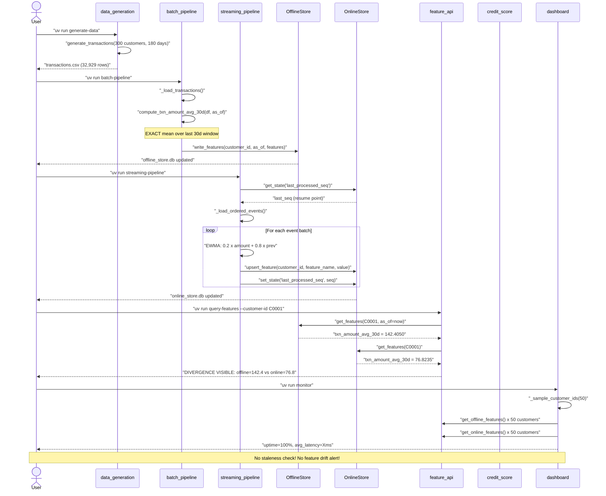
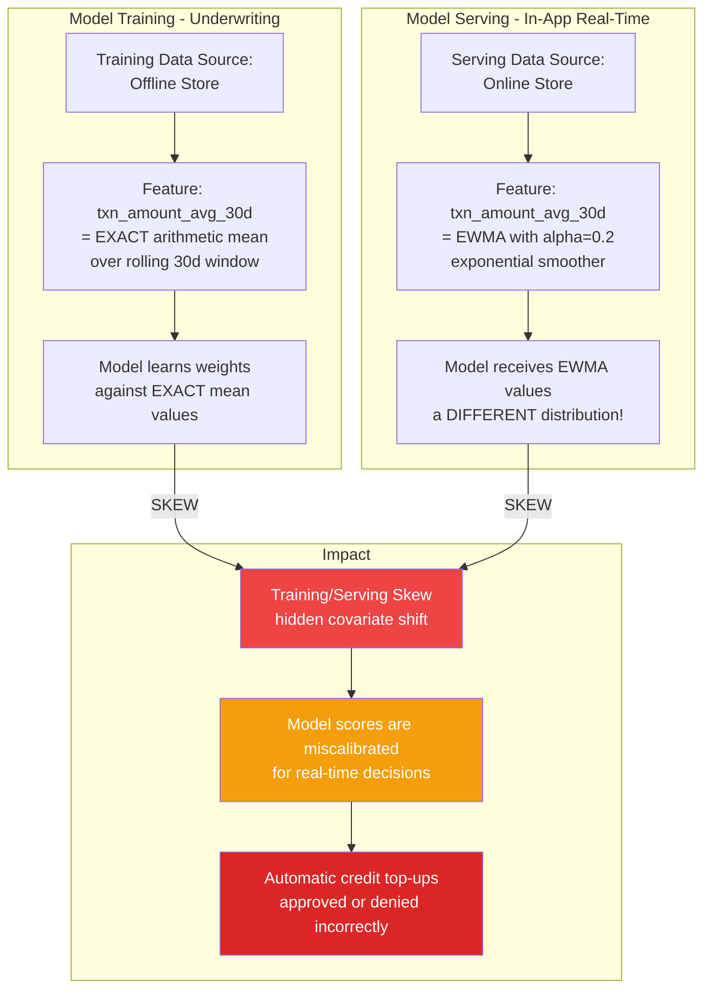
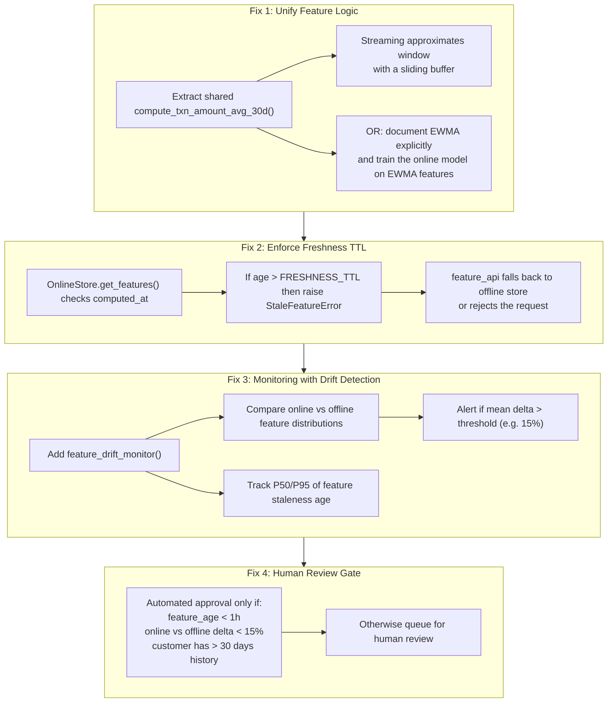
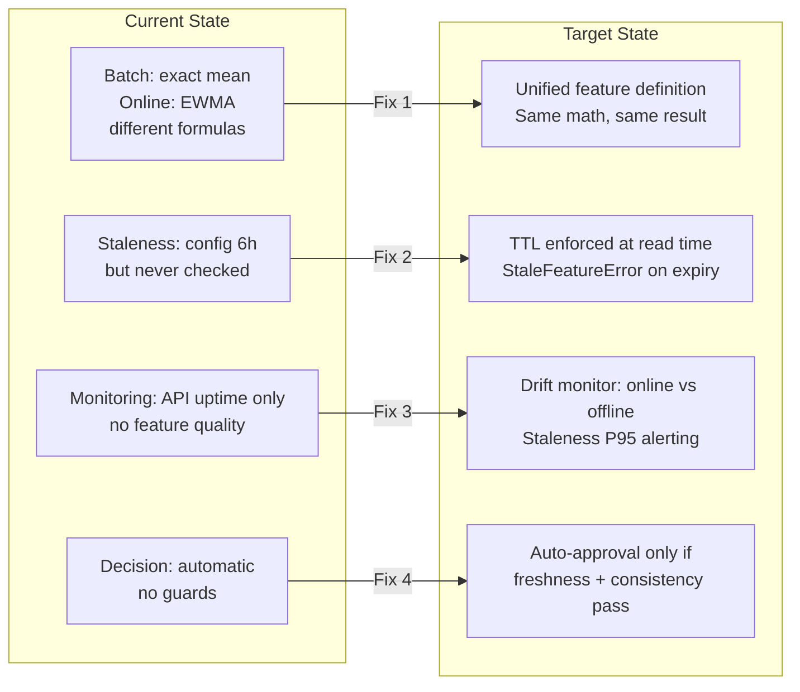

# Compass — Architecture & Business Case Analysis

> **Context**: Solara Digital Bank's feature store and pipeline. Computes features from customer transaction data and serves them to downstream credit models — in batch (underwriting) and near-real-time (in-app credit line adjustments).

---

## Table of Contents

1. [System Overview](#1-system-overview)
2. [Component Architecture](#2-component-architecture)
3. [Data Flow — Batch Path](#3-data-flow--batch-path)
4. [Data Flow — Streaming Path](#4-data-flow--streaming-path)
5. [Database Schema (ER Diagram)](#5-database-schema-er-diagram)
6. [UML Class & Module Diagram](#6-uml-class--module-diagram)
7. [Execution Sequence — End-to-End](#7-execution-sequence--end-to-end)
8. [The Core Risk: Training/Serving Skew](#8-the-core-risk-trainingserving-skew)
9. [Risk Mapping to Business Case](#9-risk-mapping-to-business-case)
10. [Proposed Solution Architecture](#10-proposed-solution-architecture)

---

## 1. System Overview



---

## 2. Component Architecture



---

## 3. Data Flow — Batch Path

> **Trigger**: nightly cron / manual `uv run batch-pipeline`
> **Formula**: `mean(amount)` where `event_timestamp ∈ [as_of - 30d, as_of]`



**Key properties of the batch path:**
- ✅ **Exact**: arithmetic mean over a precise time window
- ✅ **Reproducible**: same input → same output always
- ✅ **Point-in-time safe**: keyed by `as_of`, never overwrites history
- ❌ **Expensive**: full table scan on every run
- ❌ **Latency**: hours-old (nightly cadence)

---

## 4. Data Flow — Streaming Path

> **Trigger**: continuous / `uv run streaming-pipeline`
> **Formula**: EWMA — `α × new_amount + (1 - α) × prev_avg` where `α = 0.2`



**Key properties of the streaming path:**
- ✅ **Fast**: O(1) per event, no full table scan
- ✅ **Incremental**: resumes from last position via `pipeline_state`
- ❌ **Approximate**: EWMA is an exponential smoother, NOT a 30d window
- ❌ **Order-sensitive**: result depends on event arrival order
- ❌ **Silent staleness**: no alert if `computed_at` exceeds `FRESHNESS_TTL` (6h)

---

## 5. Database Schema (ER Diagram)



**Schema observations relevant to the business case:**

| Property | Offline Store | Online Store |
|---|---|---|
| **File** | `offline_store.db` | `online_store.db` |
| **Table** | `offline_features` | `online_features` |
| **Primary Key** | `(customer_id, as_of, feature_name)` | `(customer_id, feature_name)` |
| **History** | ✅ Keeps all `as_of` snapshots | ❌ One row per customer (overwritten) |
| **Staleness detection** | N/A — batch is always fresh | ❌ No TTL enforcement in schema |
| **Formula** | Exact 30d mean | EWMA α=0.2 |
| **`FRESHNESS_TTL`** | Not applicable | Defined in config (6h), **not enforced** |

---

## 6. UML Class & Module Diagram



---

## 7. Execution Sequence — End-to-End



---

## 8. The Core Risk: Training/Serving Skew

> This is the central problem the Business Case asks you to identify and solve.



### Quantifying the skew (from our run)

| Metric | Offline (Batch) | Online (Streaming) | Delta |
|---|---|---|---|
| `txn_amount_avg_30d` for C0001 | **142.41** | **76.82** | **~46% lower** |
| Formula | Exact 30d mean | EWMA α=0.2 | Different math |
| Freshness guarantee | Computed at run time | May be stale (6h TTL not enforced) | No enforcement |

### Why EWMA ≠ 30d mean

```
Exact 30d mean:  sum(all amounts in window) / count
EWMA:            α × latest_amount + (1-α) × previous_EWMA
                 where α = 0.2 (heavy discount on old values)

EWMA is "recency-biased" — it decays historical values exponentially.
For customers with high recent spending but lower historical amounts,
EWMA will be HIGHER than the exact mean.
For customers with declining activity, EWMA will be LOWER.
Neither is wrong in isolation — but using one for training and the
other for serving is a fundamental model governance violation.
```

---

## 9. Risk Mapping to Business Case

### Incident Analysis

| Incident (from PDF) | Root Cause in Code | File | Risk Category |
|---|---|---|---|
| Customer complaint: credit limit based on "outdated transaction pattern" | `FRESHNESS_TTL = 6h` defined in `config.py` but never enforced at read time | `online_store.py`, `config.py` | **Silent Staleness** |
| Credit line adjustments inconsistent with underwriting score | Batch uses `mean()`, streaming uses EWMA | `batch_pipeline.py` L28 vs `streaming_pipeline.py` L72 | **Training/Serving Skew** |
| Monitoring shows 100% uptime but model quality degraded | `dashboard.py` measures only API latency and uptime — no feature drift, no staleness alert | `monitoring/dashboard.py` | **Blind Monitoring** |

### Business Case Questions → Code Evidence

**Q1: What are the risks of removing human review from the credit top-up flow?**

1. `feature_api.py` has NO staleness guard on `get_online_features()`. A customer with no transactions in 3 months returns a feature value — just stale.
2. `credit_score.py decide()` has no confidence bounds or data freshness check. It scores with stale `76.82` as happily as fresh `142.41`.
3. `monitoring/dashboard.py` measures API health (latency/uptime) but NEVER checks if online store data is fresh. A model on 7-day-old features shows 100% uptime.

---

## 10. Proposed Solution Architecture



### Before vs After



---

## How to Run Analyses

```bash
# 1. Full pipeline setup
uv run generate-data
uv run batch-pipeline
uv run streaming-pipeline

# 2. Query and compare feature values (the skew is visible here)
uv run query-features --customer-id C0001

# 3. Health check (shows uptime/latency - does NOT check staleness)
uv run monitor

# 4. Run tests
uv run pytest -v

# 5. Explore raw data directly
sqlite3 data/raw/offline_store.db "SELECT * FROM offline_features WHERE customer_id='C0001';"
sqlite3 data/raw/online_store.db "SELECT * FROM online_features WHERE customer_id='C0001';"
sqlite3 data/raw/online_store.db "SELECT * FROM pipeline_state;"
```

---

*Generated for the Solara Digital Bank / Compass Feature Pipeline Business Case Analysis.*
