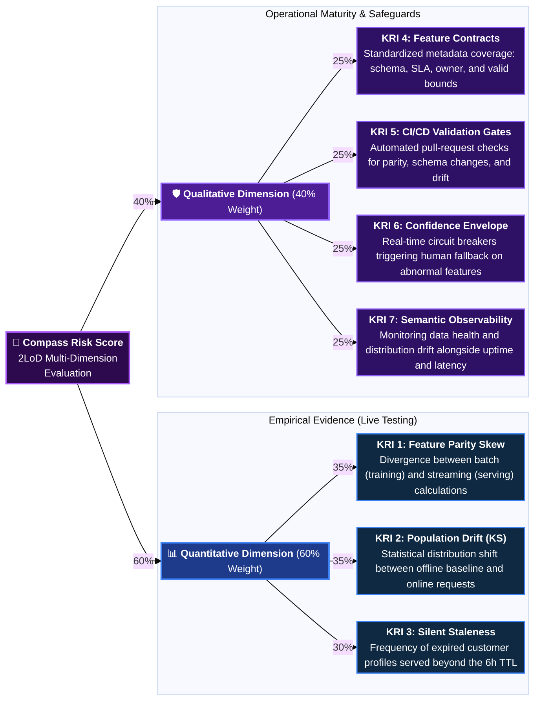
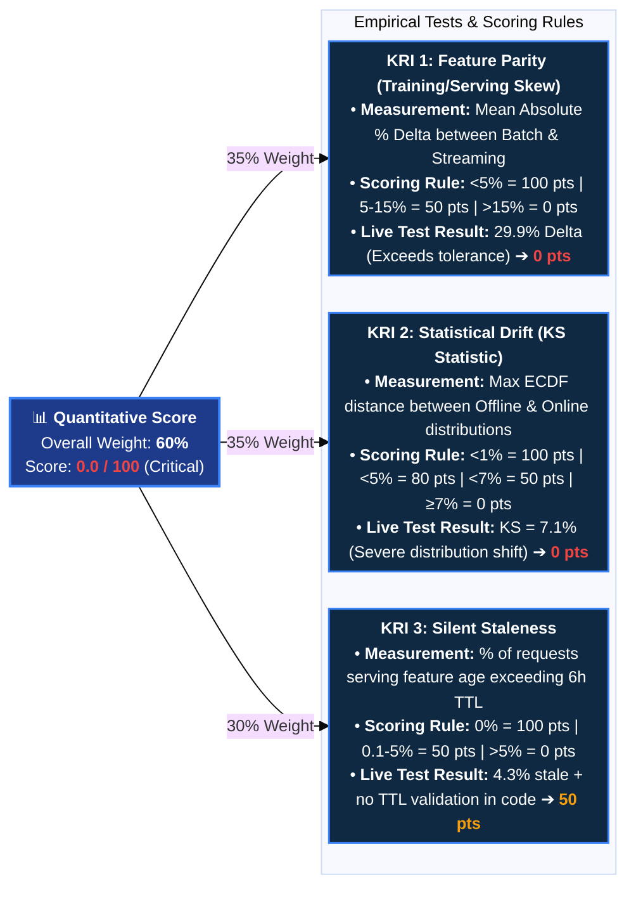
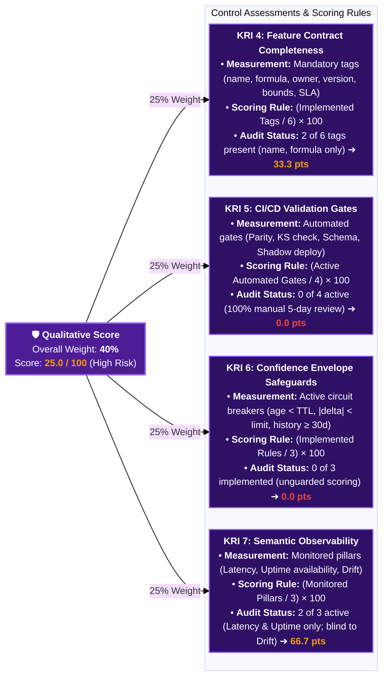

# Compass Model Risk Architecture & KRI Scorecards

## 1. Overview: Executive KRI Architecture

---

## 2. Quantitative Dimension Deep Dive (Empirical Data Health)

---

## 3. Qualitative Dimension Deep Dive (Governance & Controls)

